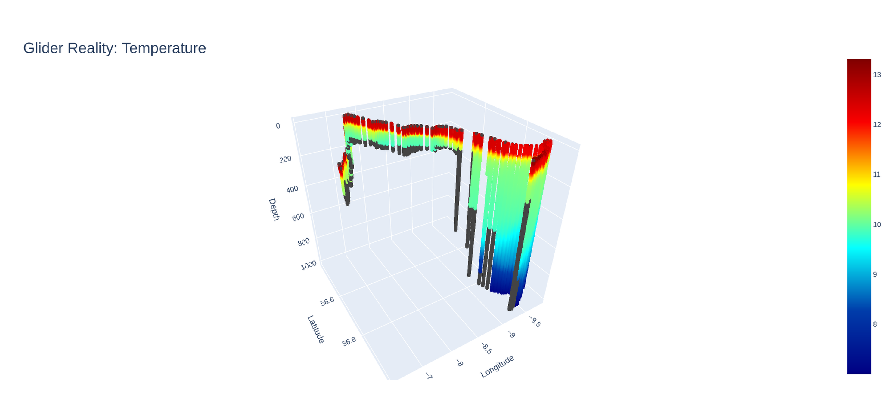

# Mamma Mia toolbox

## Description
This toolbox enables the simulation of a glider through a models "virtual reality". A world is created which the glider 
will fly through, this comprises a suitable model or set of models. When creating the virtual glider the user can define
a sensor suite which can comprise of different instrumentation, e,g, CTD or ADCP. All together these components are 
defined in a mission, that when executed will return a "reality" that contains the interpolated values that the virtual 
glider observes during its mission. A trajectory is generated using a glider simulator that simulates a slocum glider.


*Example trajectory of a glider, the colour denotes time (the darker the colour the older the section of the trajectory is)*

When processed through Mamma mia, this trajectory results in a reality, containing interpolated data from an model. 
The screenshot below shows what this would look like. The temperature the glider experiences over the trajectory is
shown as a colour.


*Example reality produced by Mamma mia, this has been generated using the trajectory above and a CMEMS global model.*

Mamma mia will be able to produce a reality based on the sensor specification of the virtual AUV. This will be able 
to be visualised and exported to use for planning and operations.

## Requirements
Mamma mia has a number of dependencies, (numpy pyinterp, xarray, zarr, ploty etc). These can be installed using a conda
compatible package manager e.g. conda, miniconda, mamba, miniforge etc.

## Installation
Assuming a conda package manager:

```shell
$ conda env create --file enviroment.yml
```
This should create a virtual environment containing all of Mamma mias dependencies. Ensure the environment is activated
before using,

```shell
$ conda activate mm
```

### Installing the glider simulator
Currently the glider simulator is not part of mamma mia and is used/operated seperately. In a separate folder (or HOME) running
the following script will install the glider simulator. It is recommended a separate virtual environment to Mamma mia is
used to ensure no dependency clashes.
```#!/bin/bash

# get the source of additional packages from github
git clone https://github.com/NOC-MDP/latlon.git
git clone https://github.com/NOC-MDP/GliderNetCDF.git
pip install ./latlon ./GliderNetCDF

pip install -r requirements.txt
pip install gsw

# Get and install glidersim.
git clone https://github.com/NOC-MDP/glidersim.git
pip install glidersim

```

## Testing
### Prerequisites
In order to test Mamma mia, an glider trajectory needs to be created, please read the install and usage sections of the glider
simulator. The example script in the glidersim repository will produce the required trajectory.

### Running test suite
Mamma mia uses pytest to test its code, to test for correction installation please run:

```shell
$ pytest test.py
```
This will execute the test suite and display the results. All tests should pass.(WIP!)

## Usage
Mamma mia has the following concepts:

- AUV (virtual glider)
- Sensors (virtual sensors defined in suites and groups)
- World (subset of a model)
- Trajectory (glider path through 3D space and time)
- Reality (interpolated model data onto glider trajectory)
- Mission (all the above stored in one object)

### AUV (virtual glider)
This is represented in Mamma mia as a class object, containing the sensor suite that has been specified. 

### Sensors
Sensors are grouped in several ways:

* On the AUV (SensorSuite)
* As an instrument e.g. CTD (SensorGroup)
* As a specific sensor e.g. temperature (Sensor)

Therefore, it the structure of sensors is as follows: 

```
    SensorSuite -> SensorGroup -> Sensor
```

#### SensorSuite
This is a modified python dictionary that will only accept SensorGroup objects. This enables the user to specify any 
number of SensorGroups on an AUV.

#### SensorGroup
This is an abstract base class, therefore a child class must be created that inherits from it. The user can create 
their own group but Mammamia provides some standard groups such as:

* CTD
* ADCP

#### Sensor
Build sensors using this class, they will need to be part of an SensorGroup so they are usually declared as part of 
constructing an SensorGroup. Mamma mia will do this automatically for defined sensor groups such as an CTD but the 
user can create their own sensors in thier own group (or add to an existing one) using this class.

### World
The world is the model data that will be interpolated onto the gliders trajectory. This is currently downloaded from 
CMEMS for the full extent of the trajectory.


### Trajectory
The trajectory is currently created from a real glider dataset, it consists of a zarr group containing the latitudes, 
longitudes, depths as well as datetimes.

### Reality
Reality is a zarr Group that holds arrays that reflect the specifed sensors in the virtual AUV, this is populated with 
interpolated data from the world.

### Mission
This is the parent/main class for Mamma mia in that it holds all the other classes and performs the main functions.

### Using the glider simulator
The simulator has been modifed so it works with the example script in its README. A new mission profile has been created
called mm1, this will run a glider simulation that results in the trajectory above. (6 hours no surfacing a single waypoint)

To generate the simulation output, there needs to be a bathymetry file. GEBCO is suitable and compatible with the mm1 
configuration. However the bathymetry needs to be a subset from the global dataset. Easiest method is to download the subset
from BODC. Downloading 45-48 N and -6.5 to -8 E should be sufficent.

Generate the output by running the example.py script:

```shell
$ python example.py
```

The output "comet-mm1.nc" can then be copied into the MammaMia repository, where it should be recognised by the test.py script.

## Outstanding development
Mamma mia is in very early development and has many things outstanding, the list below is non exhaustive but provides 
an indication of future development:

- Only temperature data is available in the world
- Trajectories are generated using a seperate simulator that is fixed to August 2019.
- Unable to handle new regions, (need to manually delete zarr so a new one one download with updated data inside)
- visualisation is very basic
- currently need to build classes and then add to mission class, users should only interact with main class 
(custom sensors etc aside)


