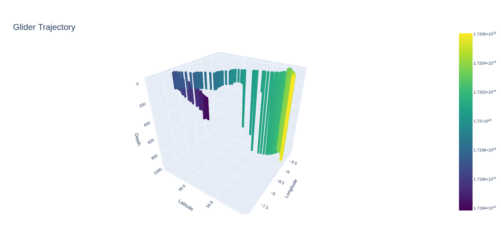
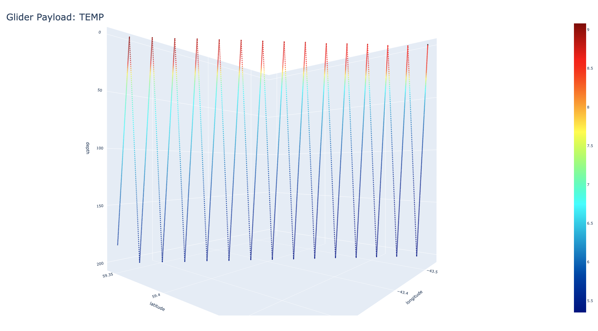
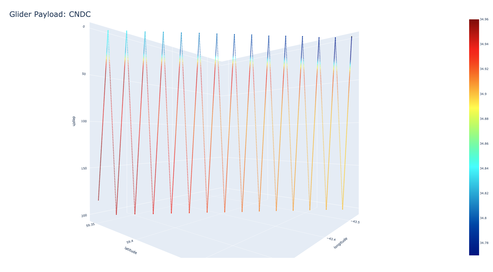

# Mamma Mia toolbox

## Description

###  Main functions
This toolbox enables the simulation of a platform through a model "virtual reality". Platforms can be any observation
platform such as gliders and autosubs. Mamma Mia takes a simulated trajectory of a platform, and creates a world encompassing
it. This world will contain data (or as much as can be found) that is defined in the platform's payload.

Each trajectory is defined as a mission, these can be added to a campaign allowing multiple platforms to operate together,
these missions can be different platforms e.g. glider and an Autosub or the same platform with different configurations. 
e.g. same glider with different payloads or the same glider with the same payload but with different model sources prioritised.

When the mission is flown, Mamma Mia will create a simulated data payload of what would be expected from the glider if it had
been operated in the real world with model data substituting observations. Some effect is made to match datasets that gliders
collect operationally, e.g. different sensor rates can be specified and comparable metadata is generated.

### Supplementary function
In addition to simulating a gliders data payload, Mamma mia can support the platform simulator by provided interpolated data
e.g. (velocity and density) to a specified spatial and temporal coordinate. This allows the simulator to take into account the 
environment when creating the trajectory.

### Example output


*Example trajectory of a glider, the colour denotes time (the darker the colour the older the section of the trajectory is)*

When processed through Mamma mia, this trajectory results in a payload, containing interpolated data from one or more models. 
The screenshots below shows an example mission of a slocum glider off Greenland


*Example glider temperature payload produced by Mamma mia, this has been generated using the trajectory above and a CMEMS global model.*


*Example glider salinity payload produced by Mamma mia, this has been generated using the trajectory above and a CMEMS global model.*

## Requirements
Mamma mia has a number of dependencies, (numpy pyinterp, xarray, zarr, ploty etc). These can be installed using a conda
compatible package manager e.g. conda, miniconda, mamba, miniforge etc.

## Installation
Assuming a conda package manager as a virtual env:

```shell
$ conda create -n mm python=3.11 esmpy=8.8 # esmpy is not installable via pip and must be installed before mamma-mia
```
This should create a virtual environment containing python 3.11 which Mamma mia is compatible with,

```shell
$ conda activate mm
```
Then you can install Mamma Mia itself, note the command below must be run in the top level of the Mamma Mia repository.
```shell
$ pip install .
```

#### Additional installation notes
The Mamma Mia dependency, PyInterp builds from source in pip and will need some C++ dependencies installing:
- g++
- cmake
- boost
- egien3

These can be installed in Ubuntu:
```shell
$ sudo apt-get install g++ cmake libeigen3-dev libboost-dev
```
or macos with homebrew (may need xcode command tools installing):
```shell
$ brew install egien boost cmake g++
```
Alternatively install pyinterp using conda as this provides a compiled binary:
```shell
$ conda install pyinterp=2024.6
```

### Installing the glider simulator
Currently, the glider simulator used in the example is not part of mamma mia and is used/operated separately. 
In a separate folder (or HOME) running the following script will install the glider simulator. It is recommended a 
separate virtual environment to Mamma mia is used to ensure no dependency clashes. Mamma mia is designed to be agnostic 
to the physical simulator allowing gliders, autosubs, argo floats and potentially even air ships to be simulated.

```#!/bin/bash
# get the source of additional packages from github
git clone https://github.com/NOC-MDP/latlon.git
git clone https://github.com/NOC-MDP/GliderNetCDF.git
pip install ./latlon ./GliderNetCDF

pip install -r requirements.txt
pip install gsw

# Get and install glidersim.
git clone https://github.com/NOC-MDP/glidersim.git
pip install glidersim
```

## Testing
### Prerequisites
In order to test Mamma mia, a glider trajectory needs to be created, please read the installation and usage sections of the glider
simulator. The example script in the glidersim repository should produce the example trajectory shown above.

### Running test suite
Mamma mia uses pytest to test its code, to test for correction installation please run:

```shell
$ pytest test.py
```
This will execute the test suite and display the results. All tests should pass.(WIP!)

### Example scripts
In addition to the pytest suite there are some example scripts showing how Mamma Mia can be used.

#### campaign_test.py
Running this script will run an example campaign with a single glider mission that undertakes a number of dives off
Greenland in 2019. It demostrations the main functions of Mamma mia as follows:

- creating a campaign
- listing available platform types
- listing available platforms of a specific type (glider)
- creating a platform/entity from the inventory
- listing available CTD sensors for that platform entity
- listing available radiometers for that platform entity
- creating a CTD entity suitable for the platform
- updating the CTD sample rate
- registering the sensor to the platform
- creating a new entity of the same platform but with no CTD to add
- register both platforms to the campaign
- create custom metadata objects such as 
  - creator
  - publisher
  - contributor
- add a mission to the campaign, specifying which entity to use and where the trajectory is located
- initialising the catalog which is used to determine what model data is availble
- building the missions in the campaign (downloads model data, creates interpolators etc)
- runs the campaign which flies each mission (generates interpolated resampled data to match what is specified in the sensors)
- mission is visualised both as a trajectory and an interpolated payload
- campaign exported as a zarr group.

#### dvr_test.py
Running this script demonstrates how Mamma mia can be used to get interpolated environmental data to help simulate a platform
and generate a more accurate trajectory.

It demonstrates this as follows:

- creates an extent (Mamma mia uses trajectory to determine this in main operation)
- creates a point (where interpolated data is desired)
- Creates a reality (contains model data and interpolators as required for the extent specifed)
- shows how to teleport (returns interpolated velocities and temp/salinity for the provided point)

## Usage
Mamma Mia is designed to be flexible and be able to used as a python module allowing an interface such as a REST API, 
GUI or just a python script to be overlaid on top. An integrated product containing:

- platform simulator
- mamma mia toolbox
- user interface 

may be created in the future.

## Architecture
Mamma mia is structured in the following way with the following concepts:

- parameters (this is specific variable such as temperature)
- sensors (this is a specific sensor such as a CTD that measures , temperature, salinity, pressure)
- platforms (this is a specific platform such as a slocum glider)

Each of the components above are specified in separate JSON files, mamma mia reads these on import and creates an immutable
inventory for each. Users can then create entities from this inventory that are mutable.

It is possible to add new platforms, sensors and parameters, this is demonstrated in the pytest script "test.py". However, 
any added entries do not persist and must be added each time. It is planned that Mamma mia will read any compatible JSON files 
provided and combine those with the stored files in the module.

### Vocabulary
Mamma mia uses the following terms to describe different aspects of the toolbox

- World (subset of a model the encompasses a trajectory)
- Trajectory(flight through 3D space and time)
- Payload (interpolated model data onto resampled flight to match sensor sampling rate)
- Mission (all the above stored in one object)
- Campaign (holds missions, platforms, interpolators in one group that can be exported)

### Parameters
These specify a specific variable or dataset, an example being temperature:

```json
            {
                "parameter_name": "TEMP",
                "standard_name": "sea_water_temperature",
                "unit_of_measure": "degree_Celsius",
                "parameter_definition": "Temperature of the water body by CTD or STD",
                "seadatanet_parameter": "http://vocab.nerc.ac.uk/collection/P01/current/TEMPST01/",
                "seadatanet_unit_of_measure": "SDN:P06::UPAA",
                "source_name": "sci_water_temp",
                "ancillary_variables": "TEMP_QC"
            }
```

### Sensors
These specify a specific set of parameters along with a sampling rate. They can mirror a real sensor, the following is 
an CTD that is compatible with a slocum glider with serial number unit_397

```json
            {
                "sensor_serial_number": "9099",
                "sensor_name": "SBE Glider Payload CTD 9099",
                "instrument_type": "water temperature sensor",
                "sensor_manufacturer": "Sea-Bird Scientific",
                "model_name": "SBE Slocum Glider Payload (GPCTD) CTD",
                "sensor_model": "SBE Slocum Glider Payload (GPCTD) CTD",
                "max_sample_rate": 5,
                "parameters": {
                    "TEMP": 5,
                    "CNDC": 5,
                    "PRES": 5
                },
                "platform_compatibility": ["unit_397"]
            }
```

### Platforms
This specifies a set of sensors, along with specific platform data such as serial numbers, the following is a slocum G2 
glider called Churchill

```json
            {
                "nvs_platform_id": "B7600001",
                "platform_type": "slocum",
                "platform_manufacturer": "Teledyne Webb Research",
                "platform_model_name":"G2",
                "platform_name": "Churchill",
                "platform_family": "open_ocean_glider",
                "platform_serial_number": "unit_398",
                "platform_owner": "NOCS",
                "wmo_platform_code": 6801573,
                "data_type": "EGO glider time-series data"
            }
```


### World
The world is the model data that will be interpolated onto the glider's trajectory. This is currently downloaded from 
CMEMS and other sources for the full extent of the trajectory

### Trajectory
The trajectory is currently created from a real glider dataset, it consists of a zarr group containing the latitudes, 
longitudes, depths as well as datetimes.

### Payload
Payload is a zarr Group that holds arrays that reflect the specified sensors in the virtual AUV, this is populated with 
interpolated data from the world.

### Mission
This is the parent/main class for Mamma mia in that it holds all the other classes and performs the main functions.

### Campaign
This is the class a MM user is expected to interact with, it holds all the missions, interpolators and auv's required for a 
deployment or campaign.

## Using the glider simulator
The simulator has been modified so it works with the example script in its README. A new mission profile has been created
called mm1, this will run a glider simulation that results in the trajectory above. (6 hours no surfacing a single waypoint)

To generate the simulation output, there needs to be a bathymetry file. GEBCO is suitable and compatible with the mm1 
configuration. However, the bathymetry needs to be a subset from the global dataset. Easiest method is to download the subset
from BODC. Downloading 45-48 N and -6.5 to -8 E should be sufficient.

Generate the output by running the example.py script:

```shell
$ python example.py
```

The output "comet-mm1.nc" can then be copied into the MammaMia repository, where it should be recognised by the campaign_test.py script.

## Reality
Mamma Mia also has the abilty to return interpolated data at requested points, this is to provide environment data for the
glider simulator as part of the trajectory creation. See dvr_test.py for an example implementation.

## Known issues

When updating to python 3.12, dbdreader (glider sim dependancy) caused some issues with a missing arch (it had x84 but not arm64) so was crashing on import
This shouldn't really happen but dbdreader's setup.py seems to be written to cover linux and windows but not macos, I managed to resolve by running the following:
```shell
$ arch -arm64 pip install dbdreader --no-cache --force-reinstall
```
This explicitly installs the arm64 arch version bypassing any cached and installed versions. This is only likely to be an issue
for M series Macbooks.


