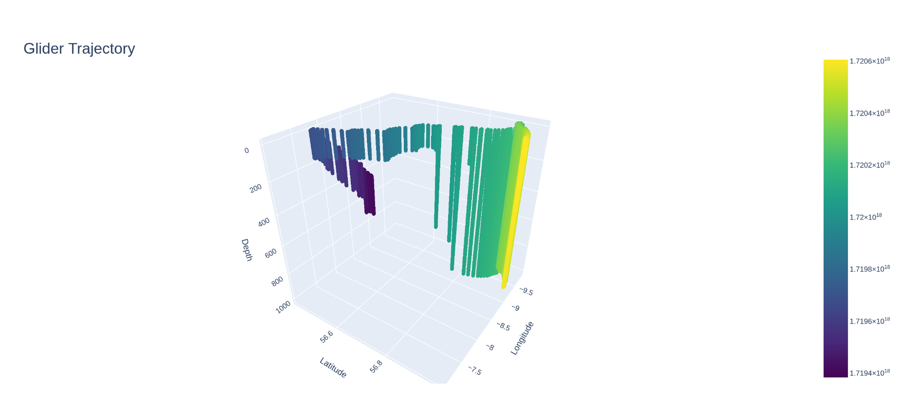
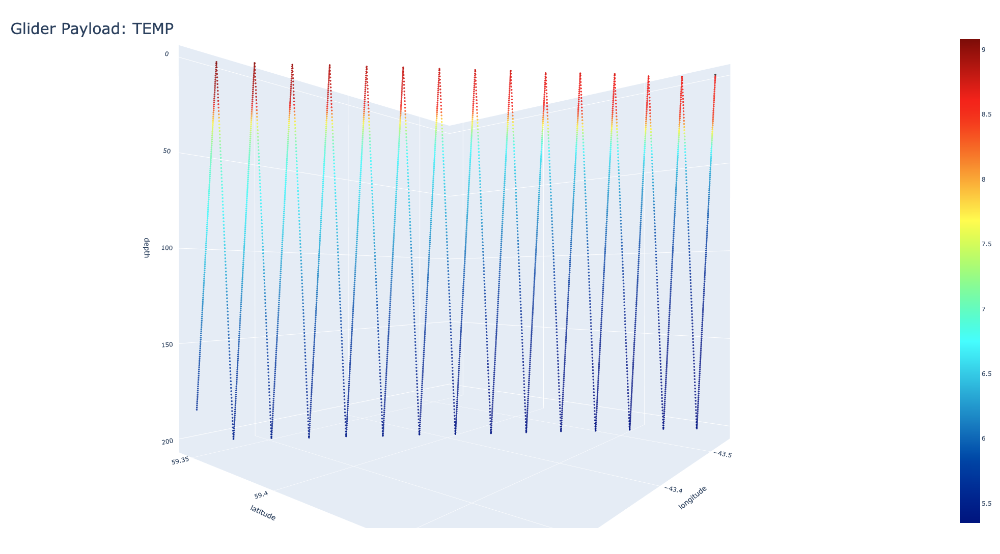
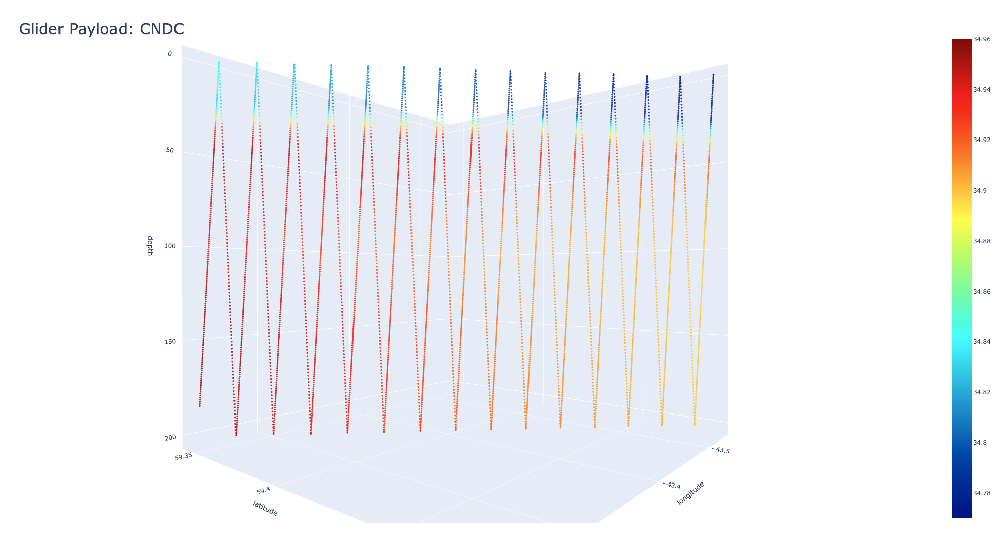

# Mamma Mia toolbox

## Description

This toolbox simulates the payload of a platform that is observing the ocean. Input trajectories have a payload simulated 
that relates to the specified sensors on the platform. Optionally the toolbox can also simulate the trajectory of a platform, currently
only slocum gliders are supported, although autosubs, argo floats and airborne (sampling ocean surface) are expected to be added 
in future releases.

For each mission (a single trajectory) the user should create a "spec" file. There are examples in the examples/spec_files folder. In these the user specifies the platform, trajectory location and what sensors the platform has on it, each sensor entry can have a different model source, and observation errors that are comparable to the sensors they are simulating.

The examples folder contains scripts allowing users to run example missions such as:

- glider virtual mooring (uses simulated glider trajectory)
- glider following waypoints (uses simulated glider trajectory)
- glider following waypoints (uses way points in csv file)

Documentation for MAMMA MIA can be found at https://noc-mdp.github.io/MammaMia/


### Supplementary function
In addition to simulating a gliders data payload, Mamma mia can support the platform simulator by providing interpolated data
e.g. (velocity and density) to a specified spatial and temporal coordinate. This allows the simulator to take into account the 
environment when creating the trajectory. This has been implemented into the glidersim library allowing it to take into account the impact currents and density have on the glider when simulating missions.

### Example outputs


*Example trajectory of a glider, the colour denotes time (the darker the colour the older the section of the trajectory is)*

When processed through Mamma mia, this trajectory results in a payload, containing interpolated data from one or more models. 
The screenshots below shows an example mission of a slocum glider off Greenland


*Example glider temperature payload produced by Mamma mia, this has been generated using the trajectory above and a CMEMS global model.*


*Example glider salinity payload produced by Mamma mia, this has been generated using the trajectory above and a CMEMS global model.*

## Requirements
Mamma mia has a number of dependencies, (numpy pyinterp, xarray, zarr, ploty etc). These can be installed using a conda
compatible package manager e.g. conda, miniconda, mamba, miniforge etc.

## Installation
Assuming a conda package manager as a virtual env:

```shell
$ conda create -n mm python=3.13 esmpy pyinterp  # these dependencies aren't easily installable via pip
```
This should create a virtual environment containing python 3.13 which Mamma mia is compatible with,

```shell
$ conda activate mm
```
Then you can install Mamma Mia itself, note the command below must be run in the top level of the Mamma Mia repository.
```shell
$ pip install .
```
### Optional dependencies
By default no simulator is installed alongside Mamma Mia, this is to simplify the install process as for example the glidersim
requires an C++ compiler to install all its dependencies, and this is an additional complication that may not be required e.g.
if the user doesn't want to simulate a glider. To install Mamma Mia with the glidersim:

```shell
$ pip install '.[glidersim]'
```
As other simulators become available they will be added here, e.g. parcels for argo float simulation.

To install all simulators (currently just glidersim) then:

```shell
$ pip install '.[all]'
```

Run an example glider virtual mooring mission

```python
$ cd examples
$ python glider_virtual_mooring.py
```

For more information see the documentation site for MAMMA MIA at https://noc-mdp.github.io/MammaMia/
