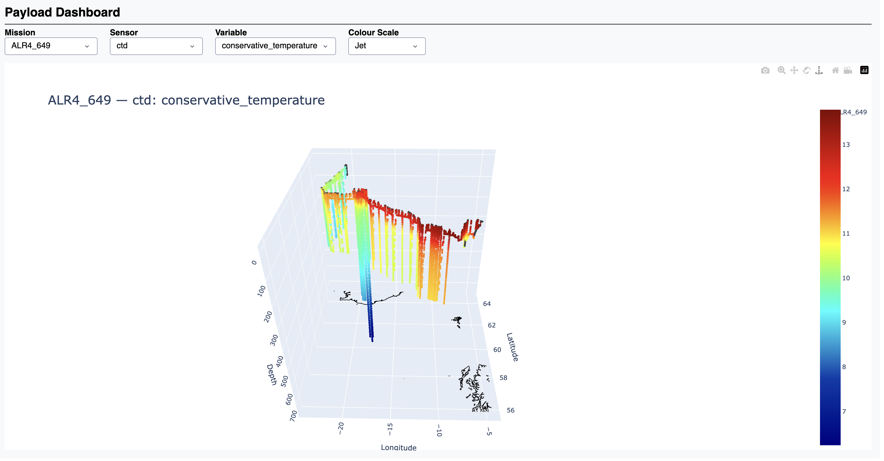
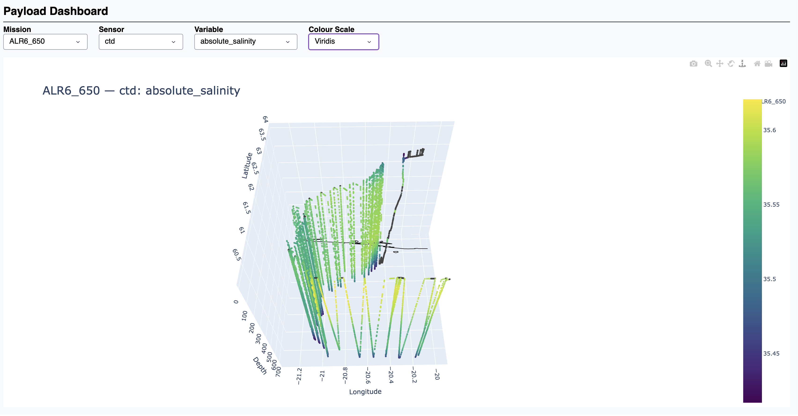
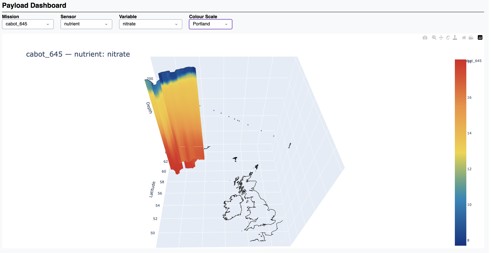
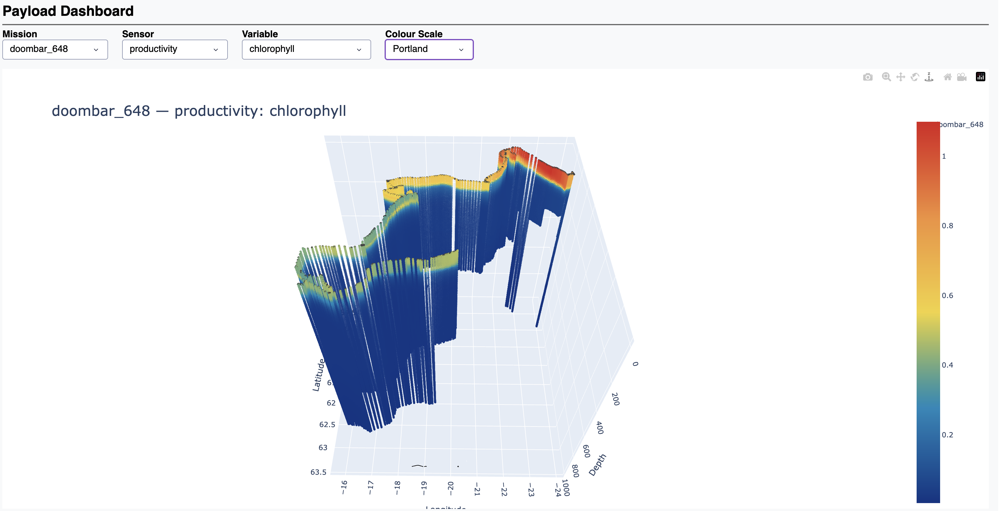
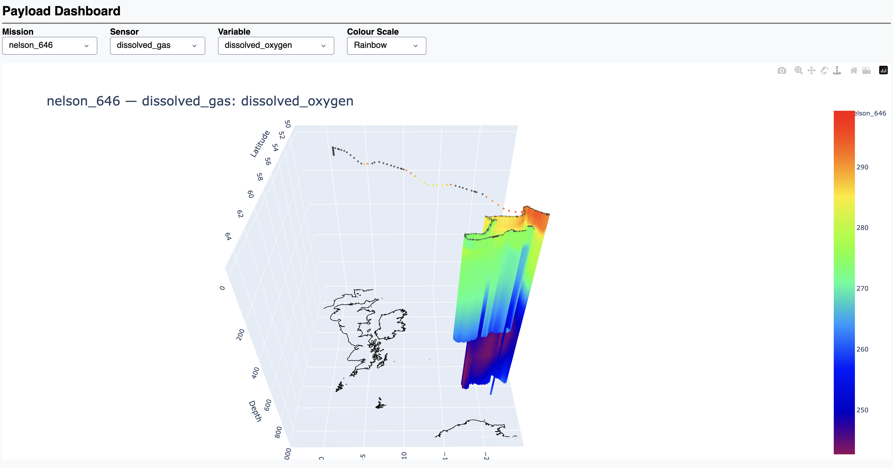
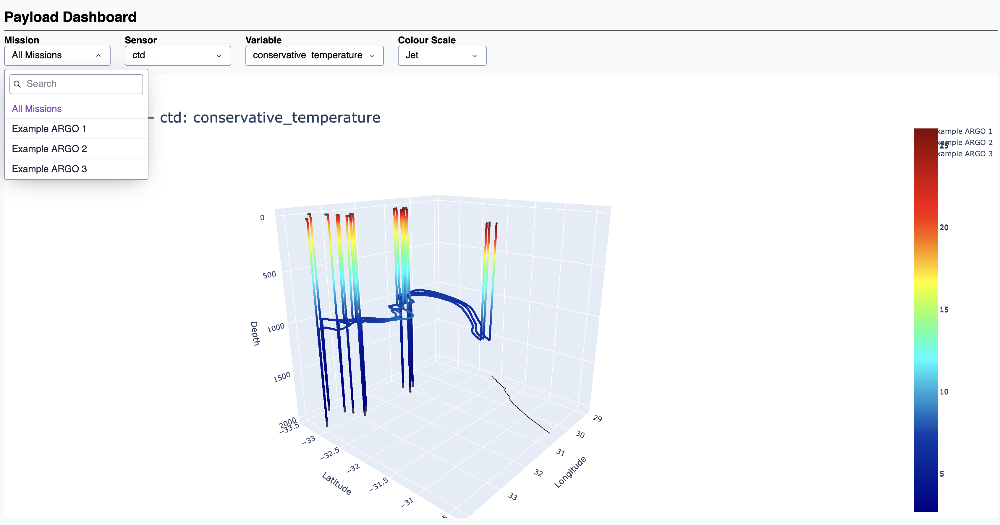

# MAMMA MIA examples
MAMMA MIA provides 5 different examples showcases the different features of the library. Each one is summarised here, with the scripts
available in the repositories examples folder.

## Glider virtual mooring
This example is documented in the getting started section, a glider acts as a virtual mooring repeatedly diving at the same point.

## Glider following waypoints
In this example the glider follows a set of way points, repeatedly diving to 1000m while travelling. 

## Simulation of research campaign BIOCARBON
MAMMA MIA can also read real platform output datasets and create synthetic payloads from the trajectories. This example emulates the real life missions of BIOCARBON
with the 4 gliders and 2 ALR's contained within a campaign DataTree. When starting the dashboard, with a Campaign the dashboard will allow all missions to display at once
or the user can select each one to show individually.

### ALR 4 (Deployment 649)
Deployment from Iceland to Scotland (showing conservative temperature)

### ALR 6 (deployment 650)
Short deployment from Iceland (showing salinity)

### Cabot glider (deployment 645)
Deployment off coast of South Iceland (showing nitrate)

### Doombar glider (deployment 648)
Deployment showing Chlorophyll 

### Nelson (deployment 646)
Deployment off South Iceland (showing dissolved oxygen)

## AUV following way points in CSV file
MAMMA MIA can also take a set of waypoints stored in CSV format. This example shows an ALR under going a transect of the Barents Sea.

!!! note
    MAMMA MIA will linearly interpolate the waypoints based on the mission time step.

## Three ARGO float campaign
MAMMA MIA can also generate synthetic payloads for ARGO floats, the simulator is not currently integrated due to incompatibility in dependencies so will need to be run in a separate python environment.

