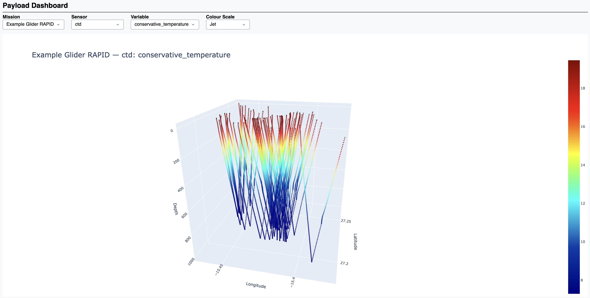

# Getting Started
Now that MAMMA MIA is installed, you can run one of the included examples. This guide walks you through running a glider mission configured as a virtual mooring (repeatedly diving in the same location).

!!! note
    Note: This mission uses a trajectory simulated via the integrated glider simulator. This section focuses specifically on synthetic payload generation. For instructions on operating the simulator itself, refer to the Glider Simulator Documentation.

## Example: Glider Virtual Mooring

The mission setup is defined in `examples/glider_virtual_mooring.py.`

### Overview of Steps

1. Importing Libraries & Setting Up Input Objects: Imports required MAMMA MIA functions and initializes trajectory and platform objects.

2. Mission Creation & Initialization: Constructs the core mission object and retrieves required environmental data and spatial interpolators.

3. Flight Simulation: Executes the mission to generate synthetic payloads.

4. Campaign Export: Wraps single or multiple missions into a Campaign object and exports the dataset.

5. Visualization: Plots the payload path and launches an interactive diagnostic payload dashboard.

### Execution

Run the script from within the examples directory:

```bash
cd examples
python glider_virtual_mooring.py
```

!!! note
    Execution time depends heavily on your network connection speed, as MAMMA MIA may need to download external oceanographic datasets upon first run.

### Log Output

Upon running, MAMMA MIA streams structured status logs highlighting INFO, SUCCESS, and WARNING events:

```json
2026-08-27 10:48:41.814 | INFO     | mamma_mia.trajectory:_create_trajectory:140 - creating a trajectory dataset using spec file spec_files/glider_spec_virtual_mooring.toml
2026-08-27 10:48:42.858 | WARNING  | mamma_mia.trajectory:__create_traj:85 - roll key not found in trajectory dataset
2026-08-27 10:48:42.858 | WARNING  | mamma_mia.trajectory:__create_traj:92 - yaw key not found in trajectory dataset
2026-08-27 10:48:42.865 | SUCCESS  | mamma_mia.platform:create_platform:43 - Successfully created platform of type: glider
2026-08-27 10:48:42.865 | INFO     | mamma_mia.mission:_create_mission:109 - creating a mission datatree called Example Glider RAPID
2026-08-27 10:48:42.865 | INFO     | mamma_mia.mission:_create_mission:112 - Platform requires NMEA coordinate conversion
2026-08-27 10:48:44.289 | SUCCESS  | mamma_mia.mission:_create_mission:119 - Successfully converted from NMEA coordinates to decimal degrees
2026-08-27 10:48:44.300 | SUCCESS  | mamma_mia.mission:_create_mission:161 - successfully created root dataset with mission and geospatial attributes
2026-08-27 10:48:44.390 | SUCCESS  | mamma_mia.mission:_create_mission:189 - successfully interpolated trajectory to match specified mission timestep
2026-08-27 10:48:44.391 | SUCCESS  | mamma_mia.mission:_create_mission:203 - successfully built payload dataset
2026-08-27 10:48:44.391 | SUCCESS  | mamma_mia.mission:_create_mission:228 - successfully determined and created platform state
2026-08-27 10:48:44.392 | SUCCESS  | mamma_mia.mission:_create_mission:238 - mission Example Glider RAPID datatree created successfully
2026-08-27 10:48:44.394 | INFO     | mamma_mia.get_data:_get_data:91 - getting data as specified in mission attributes
2026-08-27 10:48:44.394 | WARNING  | mamma_mia.get_data:__download_data:109 - no source id found for pressure
2026-08-27 10:48:44.395 | INFO     | mamma_mia.get_data:__get_local:170 - file found at source id path: ../rapid_data/2_RAPID36_1d_gridT_RAPID1_202303-202303.nc
2026-08-27 10:48:44.410 | INFO     | mamma_mia.get_data:__get_local:170 - file found at source id path: ../rapid_data/2_RAPID36_1d_gridT_RAPID1_202303-202303.nc
2026-08-27 10:48:44.421 | INFO     | mamma_mia.get_data:__get_cmems:208 - getting cmems model cmems_mod_glo_bgc-bio_anfc_0.25deg_P1D-m_-14.876_-15.967_27.765_26.684_1103.186_2023-02-01_2023-04-09.zarr
2026-08-27 10:48:44.421 | INFO     | mamma_mia.get_data:__get_local:170 - file found at source id path: ../rapid_data/2_RAPID36_1d_gridT_RAPID1_202303-202303.nc
2026-08-27 10:48:44.433 | INFO     | mamma_mia.get_data:__get_cmems:208 - getting cmems model cmems_mod_glo_bgc-bio_anfc_0.25deg_P1D-m_-14.876_-15.967_27.765_26.684_1103.186_2023-02-01_2023-04-09.zarr
2026-08-27 10:48:44.433 | INFO     | mamma_mia.get_data:__get_cmems:208 - getting cmems model cmems_mod_glo_bgc-nut_anfc_0.25deg_P1D-m_-14.876_-15.967_27.765_26.684_1103.186_2023-02-01_2023-04-09.zarr
2026-08-27 10:48:44.433 | INFO     | mamma_mia.get_data:__get_local:170 - file found at source id path: ../rapid_data/2_RAPID36_1d_gridT_RAPID1_202303-202303.nc
2026-08-27 10:48:44.442 | INFO     | mamma_mia.get_data:__get_cmems:208 - getting cmems model cmems_mod_glo_bgc-bio_anfc_0.25deg_P1D-m_-14.876_-15.967_27.765_26.684_1103.186_2023-02-01_2023-04-09.zarr
2026-08-27 10:48:44.442 | INFO     | mamma_mia.get_data:__get_cmems:208 - getting cmems model cmems_mod_glo_bgc-nut_anfc_0.25deg_P1D-m_-14.876_-15.967_27.765_26.684_1103.186_2023-02-01_2023-04-09.zarr
2026-08-27 10:48:44.442 | INFO     | mamma_mia.get_data:__get_cmems:208 - getting cmems model cmems_mod_glo_bgc-pft_anfc_0.25deg_P1D-m_-14.876_-15.967_27.765_26.684_1103.186_2023-02-01_2023-04-09.zarr
2026-08-27 10:48:44.442 | SUCCESS  | mamma_mia.get_data:_get_data:95 - data acquired successfully
2026-08-27 10:48:44.443 | INFO     | mamma_mia.interpolator:_create_interpolator:121 - creating interpolator for mission Example Glider RAPID
2026-08-27 10:48:44.452 | INFO     | mamma_mia.interpolator:_create_interpolator:139 - dataset ../rapid_data/2_RAPID36_1d_gridT_RAPID1_202303-202303.nc needs regridding, performing now
2026-08-27 10:49:06.786 | SUCCESS  | mamma_mia.interpolator:_create_interpolator:216 - regridding successful
2026-08-27 10:49:06.854 | INFO     | mamma_mia.interpolator:_create_interpolator:139 - dataset ../rapid_data/2_RAPID36_1d_gridT_RAPID1_202303-202303.nc needs regridding, performing now
2026-08-27 10:49:26.942 | SUCCESS  | mamma_mia.interpolator:_create_interpolator:216 - regridding successful
2026-08-27 10:49:27.710 | SUCCESS  | mamma_mia.interpolator:_create_interpolator:221 - interpolator created successfully
2026-08-27 10:49:27.761 | INFO     | mamma_mia.fly:_fly:59 - flying Example Glider RAPID using glider
2026-08-27 10:49:27.764 | INFO     | mamma_mia.fly:_fly:88 - apply simulated observation errors set to True, applying to conservative_temperature now
2026-08-27 10:49:27.769 | INFO     | mamma_mia.fly:_fly:88 - apply simulated observation errors set to True, applying to absolute_salinity now
2026-08-27 10:49:27.770 | WARNING  | mamma_mia.fly:_fly:73 - no interpolator found for variable pressure in sensor ctd
2026-08-27 10:49:27.770 | INFO     | mamma_mia.fly:_fly:78 - missing interpolator is pressure, will convert from depths coords
2026-08-27 10:49:27.771 | INFO     | mamma_mia.fly:_fly:88 - apply simulated observation errors set to True, applying to pressure now
2026-08-27 10:49:27.771 | WARNING  | mamma_mia.sim_error:simulate_sensor_error:82 - null values set in sensor specification no obs error applied
2026-08-27 10:49:27.772 | INFO     | mamma_mia.fly:_fly:88 - apply simulated observation errors set to True, applying to dissolved_oxygen now
2026-08-27 10:49:27.773 | WARNING  | mamma_mia.sim_error:simulate_sensor_error:82 - null values set in sensor specification no obs error applied
2026-08-27 10:49:27.774 | INFO     | mamma_mia.fly:_fly:88 - apply simulated observation errors set to True, applying to nitrate now
2026-08-27 10:49:27.774 | WARNING  | mamma_mia.sim_error:simulate_sensor_error:82 - null values set in sensor specification no obs error applied
2026-08-27 10:49:27.775 | INFO     | mamma_mia.fly:_fly:88 - apply simulated observation errors set to True, applying to chlorophyll now
2026-08-27 10:49:27.775 | WARNING  | mamma_mia.sim_error:simulate_sensor_error:82 - null values set in sensor specification no obs error applied
2026-08-27 10:49:27.775 | SUCCESS  | mamma_mia.fly:_fly:121 - Example Glider RAPID flown successfully
2026-08-27 10:49:27.776 | SUCCESS  | mamma_mia.campaign:create_campaign:50 - Campaign 'RAPID virtual mooring' created successfully
2026-08-27 10:49:27.780 | SUCCESS  | mamma_mia.campaign:add_mission:75 - Added 1 mission(s) to campaign 'RAPID virtual mooring'
2026-08-27 10:49:30.199 | SUCCESS  | mamma_mia.plot:plot_path:715 - successfully created platform path plot.
2026-08-27 10:49:30.199 | INFO     | mamma_mia.plot:start_payload_dashboard:600 - starting payload dashboard...
```

### Interpreting Logs & Warnings

**General Flow:** Logs track process stages including trajectory initialization, coordinate conversions, remote data acquisition, spatial regridding, mission execution, and dashboard initialization.

**Non-Critical Warnings:** Warnings indicate minor configuration gaps that MAMMA MIA gracefully handles.

**Missing Orientation Keys (roll/pitch/yaw):** MAMMA MIA proceeds normally using provided latitude, longitude, and depth.

**Unspecified Sensor Error Rules:** If error parameters are unset for a sensor, MAMMA MIA skips error simulation for that variable while continuing flight calculations.

### Payload Dashboard

Once complete, the local web dashboard opens automatically (typically at http://localhost:8050):



## Core Concepts

MAMMA MIA is built as a modular framework around Xarray data structures (DataArray, Dataset, and DataTree). Key components include:

### Create Trajectory Function

Reads position specifications from configuration files (supporting .nc, .csv, or .zarr inputs). Returns standard Xarray datasets with standardized variable nomenclature, filled gaps via linear interpolation, and updated metadata attributes.

```python
trajectory = create_trajectory(spec_file="path_to_spec_file")
```

### Create Platform Function

Reads the platform specification in the spec file and returns an Xarray dataset that contains the specification as metadata attributes.

```python
platform = create_platform(spec_file="path_to_spec_file")
```

### Create Mission DataTree
MAMMA MIA stores its data in an Xarray datatree format, when creating a mission it will take the platform and trajectory datasets and store them in the tree and also store the extra attributes that can be set at mission creation time.

```python
mission = create_mission(
    mission_name="Example Glider Virtual mooring",
    summary="glider performing virtual mooring mission",
    platform=platform,
    trajectory=trajectory,
    apply_obs_error=True,
    mission_time_step=60
)
```
When creating a mission, it needs a name, summary and the trajectory and platform datasets. Users can also optionally set the apply observations error boolean, and the mission time step. This is the timestep that the mission will run at, by default it is 60 seconds.

!!! note
    the default mission time step of 60 seconds may need to be increased for longer duration missions depending on the constraints of the system MAMMA MIA is being ran on.

### Get Data function
This function will find, subset and download the model data sources specified in the spec file, (now stored in the mission Datatree) ready to be interpolated onto the trajectory.

```python
mission = get_data(mission=mission)
```

The function takes a mission Datatree and returns the Datatree with the data locations stored as attributes. 

!!! warning
    MAMMA MIA will cache the data locally in folders for each model source type (e.g. CMEMS) the user must ensure there is sufficient storage space.

### Create Interpolator Function
This creates the interpolator object from an mission DataTree, this is used to interpolate the model source data onto the platform trajectory.

```python
interpolator = create_interpolator(mission=mission)
```

This requires an mission Datatree that has cached its required data sources locally (run get_data function).

### Fly Mission
This function will "fly" the mission and interpolate the model source data onto the trajectory while also applies the sensor observation errors as set in the specification file. This also requires the apply_obs_error boolean to be set to True.

```python
mission = fly(mission=mission, interpolators = interpolator)
```

### Campaign DataTree
MAMMA MIA also has the option to run multiple missions as a mission can only contain one platform, if a user wants to run more then they can be combined into a campaign Datatree. First an empty campaign with some basic metadata is created.

```python
campaign = create_campaign(
    campaign_name="virtual mooring",
    description="single glider performing virtual mooring",
)
```

Then the missions can be added, the add mission function can take a single mission or a list of missions.

```python
campaign = add_mission(campaign=campaign, mission=mission)
```

### Export functions
Since the components of MAMMA MIA are Xarray objects, they can easily be exported. E.g. a campaign can be exported to ZARR.

```python
campaign.to_zarr("VirtualGlider.zarr", "w", consolidated=False)
```

!!! note
    export to netcdf is not currently supported due to incompatibility in attributes.

### Plotting Diagnostics
So far we have only see log output but there is a diagnostic plotting option in MAMMA MIA to see and verify the output.

First is an simple plot to show the trajectory, this allows users to verify the trajectory is as expected.

```python
plot_path(missions=mission)
```

There is also a interactivate payload dashboard that can take single or a list of mission DataTrees.

```python
start_payload_dashboard(missions=mission)
```

This start an interactive dashboard allowing the user to switch between missions, variables, sensors and colourmaps.
