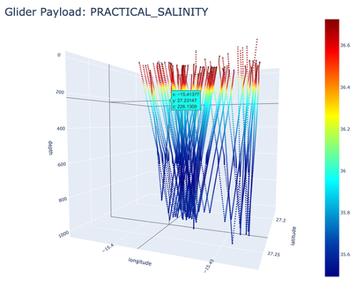

# Summary
Autonomous underwater vehicles (AUVs) and ocean gliders rely on a wide variety of onboard payloads—such as CTDs, ADCPs, 
fluorometers, and passive acoustic sensors—to collect high-resolution in situ ocean data. Before deployment, mission planners
and researchers often need to simulate how these payloads will behave when embedded in complex 3D or 4D ocean environments. 
This includes anticipating sampling resolution, environmental conditions, and sensor-specific responses to varying water masses.
Mamma Mia is an open-source Python library designed to address this need. It provides a flexible framework for simulating 
the behaviour of glider and AUV payloads within model-derived ocean fields, using data from online sources such as the
National Oceanography Centre and the Copernicus Marine Service or locally from downloaded model data. The library supports
multiple platforms at once and allows users to simulate campaigns with a diverse range of platforms. Optionally the library can also simulate the behaviour of specific platform types, Slocum gliders and Autosub’s.
The library has been developed with an emphasis on usability, extensibility, and performance. It is built on widely used 
scientific Python libraries—NumPy, Pyinterp, Xarray, and Zarr—and can be integrated into real-time or offline mission 
planning workflows. It supports exporting to Zarr, a format suitable for visualization tools such as ParaView.

# Statement of Need
Ocean scientists often rely on numerical ocean models to plan missions and interpret observational data. Yet, while many
community tools exist for working with model outputs, there is a lack of streamlined, open-source software aimed specifically 
at simulating sensor payloads on mobile marine platforms. Researchers currently rely on ad-hoc scripts, isolated 
institutional software, or manual workflows to:
* Interpolate 4D model fields onto observed or simulated glider trajectories
* Apply realistic sensor sampling behaviour (e.g., burst sampling, averaging, noise models)
* Estimate expected data volumes and environmental variability along planned missions
* Combine multiple payloads into a single simulated dataset

Mamma Mia fills this gap by providing an accessible, well-tested, well-documented Python toolkit for payload simulation
using model data. It enables researchers, engineers, and students to test mission strategies, evaluate scientific return,
and develop improved onboard algorithms, without requiring access to the physical vehicles.

# Features
* 4D interpolation engine supporting temperature, salinity, currents, biogeochemical tracers, and more
* Support for glider-sawtooth trajectories or arbitrary paths
* Built-in payloads:
  * CTD sampling with noise and response-time emulation
  * Radiometers (Chlorophyll and Downwelling Radiative Flux)
  * Dissolved Gas (Oxygen)
* Able to create custom sensors, platforms and parameters
* Model input formats:
  * CMEMS (Copernicus marine toolbox)
  * NOC (OceanDataStore)
    * Local NetCDF/Zarr
* Trajectory input formats
  * CSV waypoints
  * NetCDF with trajectory (e.g. from real deployment)
* Simulated platform (Slocum gliders and Autosubs)
* Export formats:
  * Zarr

# Example usage
```python
from mamma_mia import Campaign
from mamma_mia import inventory


print(f"Available groups in inventory {inventory.list_inventory_groups()}")
print(f"Available platform types: {inventory.list_platform_types()}")
print(f"Available parameters: {inventory.list_parameters()}")
print(f"Available sensor types: {inventory.list_sensor_types()}")
print(f"Parameters Alias: {inventory.list_parameter_aliases()}")
print(f"sensors of type CTD: {inventory.list_sensors(sensor_type='CTD')}")
print(f"sensor info: {inventory.get_sensor_info(platform_type='Slocum_G2', sensor_type='CTD')}")

print("<=========> starting Mamma Mia AUV Campaign test run <===========>")
# create campaign
campaign = Campaign(name="RAPID array virtual mooring",
                    description="single Slocum glider deployment at a RAPID mooring",
                    verbose=False,
                    )
# create platform entity (mutable)
Churchill = inventory.create_platform_entity(entity_name="Churchill",platform="Slocum_G2",serial_number="unit_398")

# register sensor to platform
Churchill.register_sensor(sensor_type="CTD")
# register platform to the campaign for use in missions
campaign.register_platform(entity=Churchill)

# # # add mission
campaign.add_mission(mission_name="RAD24_01",
                     title="Churchill with CTD deployment at RAPID array mooring eb1l2n",
                     summary="single glider deployed to perform a virtual mooring flight at the eb1l2n RAPID array.",
                     platform_name="Churchill",
                     trajectory_path="data/RAPID-mooring/rapid-mooring.nc",
                     source_location="MSM",
                     mission_time_step=60,
                     apply_obs_error=True)

# Set interpolators to automatically cache as dat files (no need to regenerate them, useful for large worlds)
#campaign.enable_interpolator_cache()

# build missions (search datasets, download datasets, build interpolators etc)
campaign.build_missions()

# run/fly missions
campaign.run()

# visualise the results
campaign.missions["RAD24_01"].plot_trajectory()
campaign.missions["RAD24_01"].show_payload()
campaign.export()

```

# Figures



# Community Guidelines
Mamma Mia welcomes contributions through pull requests, GitHub issues, and community discussions.

# Acknowledgements
We acknowledge the developers of Xarray, NumPy, PyInterp and glidersim without which Mamma Mia wouldn’t be possible.

# References
