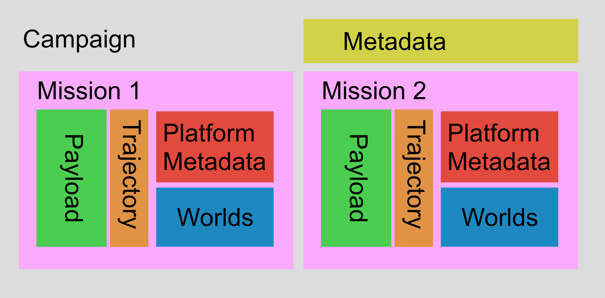

MAMMA MIA output contains the following hierarchical structure:

-   Campaign: contains one or more missions

    -   Missions: contains a single platform deployment with one or more sensors

        -   payload: contains the simulated sensor payload for the deployment

## Schematic of structure

The figure below shows how a campaign is structured, with its own metadata, then each mission is stored within it, each with its own payload, trajectory (raw input data), metadata about the platform and finally the worlds (input 3D model data).

## Campaigns

Campaigns contain all the missions for a given set of deployments. They can contain one or more missions each with its self contained set of meta data, world data and simulated payload.

## Missions

This is a single platform deployment, it contains multiple sections:

-   Payload: simulated data

-   Platform: metadata for platform

-   Worlds: gridded model data that has been used to simulate observations

## Payload

This contains all the simulated data ranging from:

-   datalogger: contains flight information like position, pitch, yaw etc

-   CTD: simulated temperature, pressure and salinity
